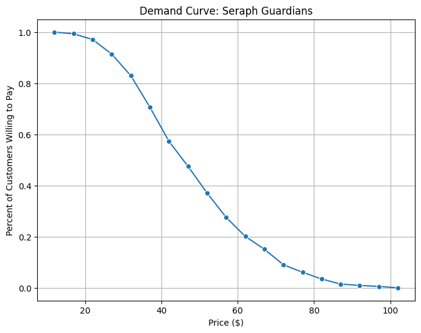
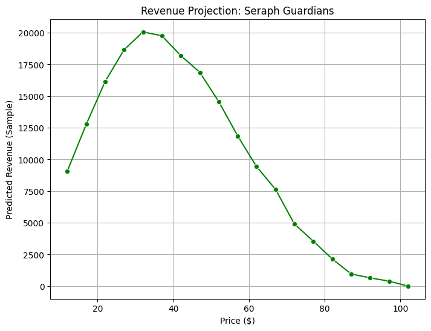

# Marketing Intelligence: Strategic Acquisition Analysis
**Academic Project | MQM: Marketing Intelligence**

## Executive Summary
This project identifies the optimal acquisition target for *Athena Softworks* within the Premium PC RPG market. Using Factor Analysis and Predictive Modeling, I evaluated three candidate titles based on market sizing, consumer personas, and profit maximization.

### Key Business Insights
* **Optimal Choice:** Seraph Guardians was selected as the primary acquisition target.
* **Pricing Strategy:** A $35 price point was recommended to maximize net profit while accounting for Steam's tier-based revenue sharing.

At this price point, Seraph Guardians captures 50.05% first-choice preference, far exceeding both Athena’s alternative titles and competing games, demonstrating higher market penetration potential

* **Player Personas:** Identified 4 distinct segments (e.g., "Action Fighters," "Story Explorers") using Factor Analysis to guide marketing positioning.
* **Positioning Strategy:** Targeted strategy for **Casual Players** and **Story Explorers** segments.
* **Positioning Message:** An accessible, strategy-rich single-player RPG that offers meaningful choices and deep gameplay without requiring extensive time commitment.

---

## Data & Features
*Note: The raw dataset is a proprietary academic dataset consisting of survey responses from 1,000+ PC gamers. To protect intellectual property and comply with academic integrity, the raw data is not included in this repository.*

The analysis is based on a structured consumer survey featuring **27 psychographic and behavioral variables**. These metrics were essential for performing Factor Analysis to identify distinct player personas.

### 1. Consumer Psychometrics (Enjoyment Metrics)
Measured on a Likert scale (1-7), these variables assess the "Enjoyment" (prefixed as `enj.`) of various gameplay elements:
* **Strategic & Cognitive:** Long-term planning (`enj.strategy`), careful decision-making (`enj.decisions`), and complex thinking (`enj.planning`).
* **Immersion & Roleplay:** Narrative immersion (`enj.immersion`) and taking on the role of another character (`enj.roleplay`).
* **Social & Altruistic:** Helping other players (`enj.helping`) and working toward common goals (`enj.common.goal`).
* **Action & Stimulation:** High-intensity gameplay (`enj.fast`), competition (`enj.competition`), and visual effects (`enj.guns`, `enj.gore`, `enj.blow.up`).

### 2. Behavioral Frequency Metrics
Measured on a Likert scale (1-7), these variables track how often (prefixed as `freq.`) players engage in specific activities:
* **Creative Customization:** Effort put into character creation (`freq.char.creation`) and visual customization (`freq.customize`).
* **Exploration:** Frequency of exploring the world for its own sake (`freq.explore`) and experimenting with world objects (`freq.experiment`).
* **Optimization:** Focusing on increasing stats/levels (`freq.stats`) and studying other players to improve techniques (`freq.study`).

### 3. Pricing & Market Simulation Data
* **Willingness-to-Pay (WTP):** Derived from the `gg.maxprice` variable, representing the maximum price point a consumer is willing to pay for a premium title.
* **Preference Data:** Discrete choice metrics used to calculate the **First-Choice Preference Share** for the candidate titles (*Warrior Guild*, *Seraph Guardians*, and *Evercrest*).
* **Revenue Tiers:** Financial modeling accounts for Steam’s 2020 revenue-sharing structure (30% for the first $10M, 25% for the next $40M, and 20% thereafter).

## Tech Stack
### **Data Science & Statistical Modeling**
- **Dimensionality Reduction:** Executed Exploratory Factor Analysis (EFA) and Principal Component Analysis (PCA) to condense 27 variables into actionable consumer segments.
- **Statistical Validation:** - **Kaiser-Meyer-Olkin (KMO):** Verified sampling adequacy to ensure the data was suitable for factor extraction.
    - **Bartlett’s Test of Sphericity:** Confirmed significant correlation between variables to reject the identity matrix hypothesis.
- **Clustering:** Applied K-Means clustering to define and validate distinct player personas based on psychographic factor scores.

### **Programming & Libraries**
- **Language:** Python (Google Colab Environment)
- **Data Manipulation:** `Pandas`, `NumPy`
- **Statistics & ML:** `FactorAnalyzer`, `Statsmodels`, `SciPy`, `Scikit-Learn`
- **Visualization:** `Matplotlib`, `Seaborn` (used for plotting Demand Curves and Preference Shares)

### **Business Intelligence & Strategy**
- **Market Simulation:** Utilized discrete choice modeling to predict "First-Choice" preference shares among three acquisition candidates.
- **Financial Engineering:** Built a profit-maximization model incorporating Steam’s tiered revenue sharing (30%/25%/20%) and royalty structures.
- **Strategic Positioning:** Transformed statistical clusters into a targeted marketing strategy for the "Casual" and "Story Explorer" segments.

## Academic Integrity & License
This repository is for portfolio purposes. The code represents individual work for the **MQM 552Q: Marketing Intelligence** final project. 
- **License:** MIT
